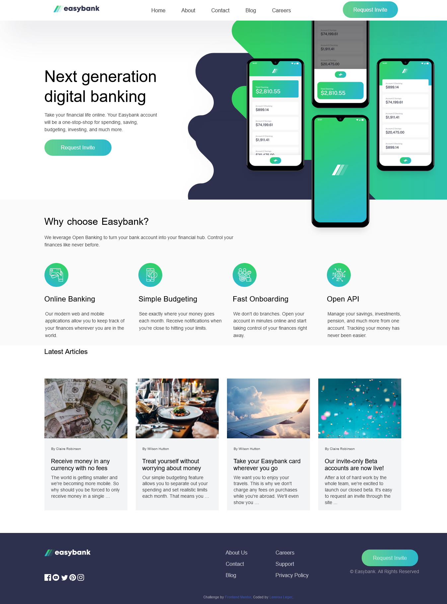
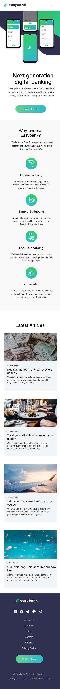

# Frontend Mentor - Easybank landing page solution

This is a solution to the [Easybank landing page challenge on Frontend Mentor](https://www.frontendmentor.io/challenges/easybank-landing-page-WaUhkoDN). Frontend Mentor challenges help you improve your coding skills by building realistic projects. 

## Table of contents

- [Overview](#overview)
  - [The challenge](#the-challenge)
  - [Screenshot](#screenshot)
  - [Links](#links)
- [My process](#my-process)
  - [Built with](#built-with)
  - [What I learned](#what-i-learned)
  - [Continued development](#continued-development)
- [Author](#author)
- [Acknowledgments](#acknowledgments)

## Overview

### The challenge

Users should be able to:

- View the optimal layout for the site depending on their device's screen size
- See hover states for all interactive elements on the page

### Screenshot

### Links

- Solution URL: 
- Live Site URL: .[.](https://lemnsa.github.io/online-bank-landing-page.github.io/)

## My process

### Built with

- Semantic HTML5 markup
- CSS custom properties
- JAVASCRIPT

### What I learned

I learned how to style SVGs (scalable vector graphics) using css.

### Continued development

I want to focus more on JS functions. 
Also how to become better at using svg resources.

### Useful resources

- [SVG styling live demo](https://www.BoxySVG.com) - This helped me for styling the svg background. I really liked this pattern and will use it going forward.

## Author

- Frontend Mentor - [@lemnsa](https://www.frontendmentor.io/profile/Lemnsa)
- Twitter - [@lemnsa1](https://www.twitter.com/lemnsa1)

## Acknowledgments
I thank the frontend mentor for this career ugrading opportunity, it is a ride to stick to with friends.
